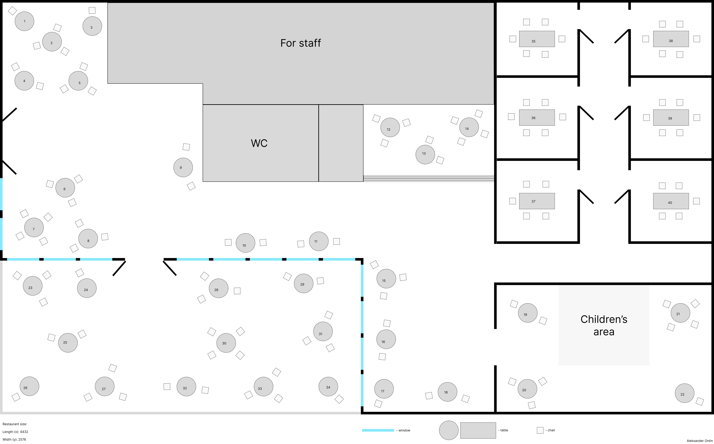

# Restaurant Table Reservation System

Web application for restaurant table reservation and intelligent table recommendation based on party size and user preferences.

Built with Spring Boot (Java 21).

## Tech Stack

- Java 21
- Spring Boot
- Spring Data JPA
- PostgreSQL
- Springdoc OpenAPI (Swagger)
- Maven

## Development Status 

Project started: 28.02.2026 
Current stage: Backend foundation (database + entities)

## Time Tracking 

Total time spent: 5.5 hours

## Architecture

Project follows layered architecture:

Controller → Service → Repository → Database

- Controllers handle HTTP requests
- Services contain business logic
- Repositories handle database operations

## Restaurant Layout

The application uses a predefined restaurant layout loaded from `tables-config.json` during application startup.

The restaurant contains **40 tables** distributed across different zones:

- **Main Hall:** 22 tables  
- **Terrace:** 12 tables  
- **Private Rooms:** 6 tables  

### Seating Capacity

- Private room tables:
  - 2 tables with capacity **5**
  - 4 tables with capacity **6**
- Main hall and terrace tables:
  - Capacity between **1 and 4 guests**

### Special Areas

- A **kids zone** is present in the restaurant.
- **4 tables** are located near the kids zone.

### Coordinates

Each table has spatial coordinates (`posX`, `posY`) representing its position in the restaurant layout.  
These coordinates allow the system to support future features such as:

- visual table layout
- intelligent table recommendation
- dynamic table grouping

### Restaurant Layout Diagram

Below is a conceptual layout of the restaurant:

### Layout Consistency Notice

The restaurant layout is defined by two components:

1. The layout image (`restaurant-layout.png`)
2. The table configuration file (`tables-config.json`)

The frontend renders tables on top of the layout image using the coordinates (`posX`, `posY`) defined in the configuration file.

⚠️ If the restaurant layout is modified, both the image and the table configuration must be updated accordingly.
Otherwise, table positions displayed in the UI may not match the actual layout.

## How to Run

### 1. Clone repository
git clone [https://github.com/RaionaAleksander/restaurant-reservation-system.git](https://github.com/RaionaAleksander/restaurant-reservation-system)

### 2. Configure database

Create PostgreSQL database: **restaurant_db**

Create user: **restaurant_user**

Update **application.properties** with credentials.

### 3. Run application

mvn spring-boot:run (or ./mvnw spring-boot:run)

Application will start on: http://localhost:8080

## API Documentation

Swagger UI:
http://localhost:8080/swagger-ui.html

## Current Progress

- Project setup completed
- Database configured
- RestaurantTable entity created
- Reservation entity implemented
- ReservationRepository created
- ReservationService implemented with basic business validation
- ReservationController created with POST endpoint
- Reservation flow tested via Swagger
- GlobalExceptionHandler added for proper API error responses (400 instead of 500)
- Fixed infinite JSON recursion in bidirectional JPA relationship
- Added Swagger parameter documentation
- Fixed validation for reservation time intervals
- Restaurant layout initialized from configuration file (tables-config.json)
- DataInitializer implemented to automatically populate restaurant tables on application startup
- Random reservation generation added (50 reservations created on startup)
- Database tables and reservations are automatically reset and regenerated on application startup
- Added configurable random reservation generator.  
  Reservation generation parameters are now externalized into `reservation-generator.properties`, allowing developers to control the number of generated reservations, client names, restaurant working hours, and visit durations without changing the code.
- Added validation to prevent creating reservations in the past.
- Separated reservation configuration into a dedicated `reservation.properties` file.  
  This file now contains restaurant business rules such as working hours, reservation duration limits, and reservation generation settings. Client names have been removed.

## Future Plans

- Implement table recommendation algorithm
- Add visual restaurant layout
- Add tests and Docker support
- Implement admin interface